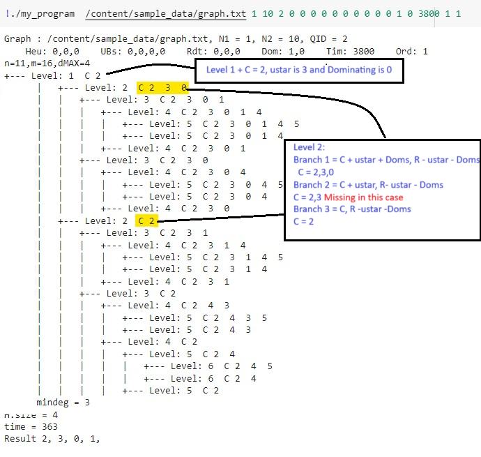

# size-bounded community search (SCS)

## Problem Statement

Given:
1. graph $G = (V,E)$
2. query $q \in V$ 
3. size constraint $[l,h]$

Find subgraph $H$ of $G$ that satisfies the bellow conditions
1. Connected: $H$ is connected and contains $q$
2. Size bound : $l < |V(H)| < h $.
3. Minimum degree of H is maximum among all sub graphs that satisfy above conditions

# Execution Guide

## 1. Compilation

### Server Side (in `./SCS` folder)
If you are running on an **NVIDIA A100 (80 GB)**, compile using:
```bash
nvcc main.cu -o SCS -std=c++14 -lpthread -ccbin=mpic++ -lmpi \
    -arch=sm_80 -gencode=arch=compute_80,code=sm_80
```

> 🔹 If using a different GPU, update the `-arch` flag accordingly.

### Client Side (in `./SCS/Client` folder)
For continuous query sending, compile with:
```bash
g++ client.cpp -o client
```

For batch query processing (using a `.txt` file), compile with:
```bash
g++ batchClient.cpp -o batchClient
```

---

## 2. Input Data Format
The input graph must be provided as an **edge list** in `.txt` format:  

- **First line**:  
  ```
  <#Vertices> <#Edges>
  ```
- **Subsequent lines**:  
  ```
  <u> <v>
  ```
  (each line represents an undirected edge, space-separated)

---

## 3. Running the Server
Example run command:
```bash
./SCS data/ego-facebook.txt 30000 100000 0.5 1 8 100 1 1 1 1 1
```

---

## 4. Query Format
Queries should follow the format:
```
<l> <h> <qid> <heuristic_flag> <limit_dominating_set>
```

- `<l>` = lower bound  
- `<h>` = upper bound  
- `<qid>` = query ID  
- `<heuristic_flag>` = whether to run heuristic (0/1)  
- `<limit_dominating_set>` = cap for dominating set  

To terminate the server, issue:
```
server_exit
```

---

## 5. Running the Client

### Continuous Query Mode
```bash
./client
```

### Batch Processing Mode
Provide a file containing queries in the same format:
Example
```bash
./client client/batch_in.txt
```
# Notes

This code solves the problem by allowing a server to handle the computational workload on a GPU, while multiple clients can simultaneously submit queries. Each query must pertain to the same graph $G$. The server processes the queries independently, leveraging the GPU for efficient computation, ensuring scalability and parallel execution.

## DATA Structures 

### CPU
 - n : Total Number of verticies
 - m : Total Number of edges
 - dMAX : Max Degree 

 - pstart : neighbors offset in orginal Graph
 - edges : neighbor List in orginal Graph
 - degree : Degree in orginal Graph
 - core : Core Values in orginal Graph

 - q_dist : Distance of each vertex from query vertex in orginal Graph (Changes for each query)

 - queryData: A structured data type designed to store all information related to a query. This includes attributes such as the lower and upper bounds for the subgraph size, the query vertex, the lower and upper bounds of the maximum minimum degree, the upper bound on the distance from the query vertex, and the number of tasks written to or read from the global buffer for the query, among other key data.

 - queries : A collection of queryData objects, representing the full set of queries being processed. Each object contains the specific parameters and results for its corresponding query.


### GPU 

#### 1. deviceGraphGenPointers:
  A structured data type that stores essential information about the original graph. It consists of four key arrays: the neighbor offset, neighbor list, vertex degree, and core value of each vertex. These arrays collectively represent the structure and properties of the original graph before any preprocessing is applied.

#### 2. deviceGraphPointers:  
A structured data type that holds information about the graph after preprocessing, with the data varying for each query. It comprises a total of 11 arrays.

- The first four arrays store graph-specific data that changes for each query, such as vertex degree, distance from the query vertex, neighbor offsets, and neighbor lists.
- The next four arrays contain metadata related to the graph for each query, including the lower and upper bounds of the maximum minimum degree, the upper bound on the subgraph size, and a user-defined limit for the dominating vertices (used during processing).
- Additionally, two arrays track the number of tasks written to or read from the global buffer for each query.
- A final array indicates whether the processing of each query has been completed, helping to manage the state of ongoing queries.

#### 3. deviceTaskPointers: 
A structured data type designed to manage task-related information, consisting of 13 arrays and a limitTasks variable.

Each array is divided into virtual partitions, with each partition assigned to a warp for simultaneous processing. This partitioning ensures that each warp can write concurrently without causing contention with other warps. The limitTasks variable sets a cap on the number of tasks that can be written into each partition.

The arrays are organized into different categories:

- **Task Information Arrays:** The first three arrays track the total number of tasks in each partition, task offsets, and the vertices involved in each task.

- **Vertex-Specific Arrays:** The next three arrays store details for each vertex in a task, such as its status (whether it belongs to set $R$ or $C$) and its degree in $C$ and $R$. For vertices in $C$ degree $(d_(R\cup v))$ in $R$ represents the degree of vertex if added to $R$ and for verticies in $R$ degree in $C$ represents the degree $(d_(C\cup v))$ if added to $C$

- **Task-Specific Arrays:** Another three arrays store task-specific information, including the size of the subgraph for each task, the query ID to which the task belongs, and the `ustar` value of the task.

- **Dominating Set Arrays:** Two arrays are dedicated to storing and calculating the set of verticies that are dominated by task's `ustar`.

- **Partition Management Arrays:** The final two arrays manage and store the partition numbers where each warp will write, ensuring efficient allocation and reducing potential write conflicts.


#### 4. deviceBufferPointers:
 If any partition in deviceTaskPointers overflows, the task-related data is stored in deviceBufferPointers. This is a structured data type consisting of five arrays, which store the task offset, task vertices, the status of task vertices, the subgraph size for each task, and the query ID to which the task belongs.

Only one warp can write to or read from the buffer at a time, but reading and writing can occur simultaneously. This means that while one warp writes, another can read concurrently. Additionally, the next warp does not need to wait for the full task to be written or read by the previous warp. Instead, it only waits until the offset information is written/read, significantly reducing contention during read/write operations. The specifics of this process will be discussed later.

To manage the system, several variables track the state of the buffer:

- The number of tasks written into the task array.
- The number of tasks read from the offset array.
- The number of tasks written into the offset array.
- readKey and writeKey are used to synchronize access to the buffer, ensuring proper coordination between reading and writing operations.

Additionally, two other variables are critical to buffer management:

- One sets the maximum number of tasks that can be written to the buffer.
- Another indicates if the buffer has run out of memory, helping to handle overflow scenarios gracefully.


## Host Program 

```cpp
1: numProcessingTasks = 0
2: serverQuit = False
3: Load Graph into CPU
4: Calculate core values of each vertex on CPU
5: Thread one: Launch to listen to messages from client
6:     while True do
7:         Listen for client messages using IPC messaging queue
8:         Push query message into query queue
8:         if message == "server_quit" then
9:             break
10:        end if
11:     end while
12: Thread two: Read and process query message.  
13:    while True do
14:        if serverQuit and numProcessingTasks == 0 then
15:            break
16:        end if
17:        while queue != empty do
18:            Read query message
18:            if message == "server_quit" then
20:                serverQuit = True
21:            else
22:                Calculate distance from query vertex on CPU
23:                Run heuristic to find the lower bound of maximum minimum degree on CPU
23:                Preprocess the task
24:                numProcessingTasks++
25:            end if
26:        end while
27:        if numProcessingTasks != 0 then
28:            Process Task
29:            Find Dominating set
30:            Expand
31:            Remove completed tasks
32:            Post Process
33:            if query is completed then
34:                Print solution
35:                numProcessingTasks--
36:            end if
37:        end if
38:    end while
```

## Preprocessing
In the preprocessing stage of the algorithm, the goal is to efficiently reduce the graph size by removing irrelevant vertices and preparing the remaining vertices for further analysis. This step involves multiple processes, including the application of reduction rules, vertex compression, neighbor offset calculation, and workload balancing.

### 1. Initial Reduction Rules:
The algorithm starts by applying two key reduction rules to filter vertices based on their relevance to the query. 

  - The core value of each vertex must be greater than lower bound of maximun minimum degree of the query.
  - The distance of each vertex from Querry vertex must be less than or equal to upper bound distance from query vertex. 
Vertices that fail to meet these criteria are removed from the set $𝑅$.

To reduce contention among threads when writing data, the array is partitioned into sections of size `pSize`, each section is process my a warp and local counters are stored in shared memory. By limiting thread competition to the warp level, where only threads within a warp compete for writing locations, this method drastically reduces the level of contention compared to a global counter approach.

This process functions similarly to a two-step procedure. In the first step, each warp calculates how many vertices from its assigned share pass the reduction conditions and stores them within its partition. This localized calculation ensures that unnecessary conflicts over  resources are minimized, enabling faster execution. The second step is done in the next kernel. 

### 2. Vertex Compression and New Neighbor Offset Calculation:
Using the claculation done my last kernel, each warp collects the vertecies from it section and writes into a continuous block of memory within the task buffer.
Task buffer is also divided into user defined partition. (see data section). The new task is placed into a partition that has the fewest existing tasks to maintain load balance. For each vertex, its status is updated: for all vertices except Query vertex , the status is set to 0 (in $R$ ) ; for the query vertex, it is set to 1 (in $C$ ) in status buffer.
Using these statuses, the degrees in both sets $C$ and $𝑅$ are calculated for each vertex in the task, and the results are stored in the two separate arrays.

For vertices that were eliminated during the reduction, their degrees in the original graph are set to zero. Additionally, the algorithm computes the new total number of neighbors for each vertex. By performing a cumulative sum over these totals, the new neighbor offset for the query vertex is determined, which will be crucial for subsequent steps.

### 3. New Neighbor List Construction:
In this stage, each warp processes a vertex and updates its neighbor list by ignoring any vertices that were eliminated during the reduction phase. Once a warp completes processing a vertex, it moves on to the next one in the list, ensuring that the workload remains balanced, even though the neighbor list size can vary significantly between vertices.

By assigning the task of processing a single vertex's neighbors to a single warp, only the threads within that warp compete for write locations. This strategic approach effectively reduces the contention for shared resources, improving the overall efficiency of the algorithm.

## Process Task
The kernel processes each task to compute the minimum degree and then compares it with the current maximum minimum degree of that query, updating it if necessary. It also calculates a degree-based upper bound, and if this upper bound exceeds the current maximum minimum degree of that query, the kernel proceeds to compute the $u^{*}$ (ustar) value for that task. This ensures that tasks only with potential for a higher minimum degree are used for further evaluation.

As previously discussed, the task list is divided into virtual partitions, where each warp processes the tasks within its partition in parallel. Within each partition, tasks are processed sequentially. Now, let's dive deeper into the task processing workflow.

### 1. Reducing the search space (R): 
- **Vertex Elimination from $R$:**

For each vertex in the set $𝑅$, the algorithm calculates the maximum potential degree it would have if added to the set $C$ (the subgraph under construction). If this potential degree is less than or equal to the current maximum minimum degree of that query, the vertex is removed from $R$ (its status is set to 2). The maximum potential degree is determined by the formula:. 
$$\text{min } \{d_{C \cup R}, d_{C \cup v} + h - |C| -1 \}$$.  
where $h$ is the upper bound on subgraph size, $C$ is the current subgraph, and $v$ is the vertex being evaluated. After removal, the degrees of the eliminated vertices and their neighbors are updated accordingly.

- **Promoting Vertices to $C$:**
For each vertex in $C$, if the sum of its degrees in $C$ and $R$ equals the current maximum minimum degree of that query, all its neighbors in $R$ are moved to $C$ (their status is set to 1). The degrees of the newly added vertices and their neighbors are updated as well.

In both scenarios, `AtomicSub` is used to update the degrees of neighboring vertices. This ensures that no race conditions occur when multiple threads attempt to update the degree of a vertex, as a vertex can be the neighbor of several others simultaneously. This mechanism prevents conflicts and ensures data consistency during parallel execution.


### 2. Branch Pruning Rule 1:
For each task, we compute the potential maximum minimum degree, also known as the degree-based upper bound (UB). This is calculated using the following formula:

$$ min_{u \in C} \text{ min } \{ d_{C \cup R}, d_{C}+h-|C| \} $$

where $h$ is the upper bound on subgraph size, $C$ is the current subgraph and $R$ is the remaining search space. 


Each thread in a warp processes a vertex and initializes the local variable degreeBasedUB to UINT_MAX. If the vertex status is 1 (i.e., part of the subgraph $C$ ), the thread calculates degreeBasedUB using the formula. Since we track the degree in $C$, degree in $R$, and the size of the subgraph for each vertex, the calculation is efficient and localized.

After calculating the degree-based UB for each vertex, warp primitive `__shfl_down_sync` is used to reduce the values within the warp, obtaining the local minimum across the 32 vertices. This local minimum is then stored in shared memory. On each iteration of 32 vertices, lane 0 compares the current local minimum with the global minimum stored in shared memory and updates it as needed.

Additionally, the degree values $(d_{C})$ for vertices in $C$ are copied into shared memory (`sharedC`) for faster access, while the degree values $(d_{C \cup v})$ for vertices in $R$ are stored in continuous memory in global memory (`globalC`) for further processing. To optimize memory usage, the array that is normally used to store dominating vertices is repurposed to store the degree values for verticies in  $R$ , minimizing memory overhead while maintaining processing efficiency.

### 2. Branch Pruning Rule 2:
The neighbor reconstruction-based upper bound also calculates the potential maximum minimum degree for a task. Both this upper bound and the degree-based upper bound are computed, and the tighter of the two bounds is used to refine the task's processing.
Each warp first sorts its corresponding `sharedC` array (which holds the degrees of vertices in $C$ ) in ascending order. The first element of `sharedC` after sorting represents the current minimum degree of the subgraph $C$ , which is stored in shared memory for further use.

Next, the globalC array (which holds the degrees of vertices in 
$R$ ) is sorted in descending order.
Let $v$ represent the vertex whose degree is stored in  `globalC` and $u$ represents the vertex whose degree is stored in `sharedC`. As already discussed $v$ belongs to $R$ and $u$ belongs to $C$. 

The logic here is based on the assumption that the vertices in $R$ with the highest connections to $C$ will be added to the vertices in $C$ with the lowest degree to get the upper bound.

Thus, for each vertex $v$ from the first $h−∣C∣$ elements of `globalC`, we increment (by 1) the degree of the first $d_{C \cup v }$ vertices in sharedC (those with the smallest degrees in C). After updating the degrees, we re-sort `sharedC` in ascending order and continue the process.

The first element in sharedC after the updates represents the neighbor reconstruction-based upper bound for the task. This value is then compared with the degree-based upper bound, and the tighter bound is used for further processing, ensuring a more accurate estimation of the potential maximum minimum degree.

### 3. Compare and Update Maximum minimum degree :
Lane 0 of each warp checks if the subgraph size of the task falls within the specified size constraints. If the size is valid, it then compares and updates the maximum minumum degree of that query using on current minimum degree.

### 4. Calcuate ustar:

For a task, if the minimum of the degree-based upper bound and the neighbor reconstruction-based upper bound is greater than the current maximum minimum degree of that query, the task has the potential to exceed the maximum minimum degree. This indicates that the task should be explored further by branching into new tasks. To do this, we add a vertex ustar from $R$ to $C$, creating two new tasks:  $(C + ustar, R − ustar)$ and $(C,R−ustar)$.

The best vertex to add to $C$ is the one with the highest number of connections to $C$, particularly to the vertices in $C$ with the lowest degrees. To quantify this, we calculate a connection score for each vertex in $R$, which helps determine which vertex should be added to $C$.

For a vertex $v \in R$, the connection score is defined as:

$$\sum_{u \in N_{C \cup v}} \frac{1}{d_{C}(u)} $$

where $N_{C \cup v}$ represents the neighbors of v in $C \cup v$ and $d_{C}u$ represents the degree of u in $C \cup u$. 

Each lane in a warp processes a vertex and initializes two variables: `score` to 0 and `ustar` to -1. If the vertex's status is 0 (indicating it belongs to $R$), the lane iterates over its neighbors and checks whether they are in $C$. If they are, it calculates the connection score and assigns the value to score.

After calculating the connection score for each vertex, the warp uses the primitive `__shfl_down_sync` to reduce the values within the warp. This identifies the local maximum connection score and the corresponding vertex (local argmax) across the 32 vertices processed by the warp. These local maximum and argmax values are stored in shared memory.

In each iteration of 32 vertices, lane 0 compares the current local maximum with the global maximum stored in shared memory, updating both the global maximum and the global argmax (the vertex to add to $C$ ) as necessary.

Once all vertices are processed, lane 0 stores the selected ustar (the vertex with the highest connection score) in global memory for future task branching and processing. This ensures the most connected vertex is added to $C$ , optimizing task exploration.

### 4. Removed processed Tasks:
Tasks that no longer require exploration are efficiently removed from the task array.

Each warp begins by checking tasks in its partition, starting from the last task. If a task’s ustar is set to INT_MAX or its query indicator is UINT_MAX, it signals that no further exploration is needed, and the number of tasks in the array is reduced by 1. The process stops as soon as a task that requires further exploration is encountered.

This approach ensures that tasks at the end of the array, which no longer need processing, are removed with minimal memory transfer. While tasks that don’t need exploration but are situated between others that do, remain in the array, the main advantage is that task removal incurs minimal overhead in terms of time and memory transfer, making the process more efficient overall.

## Find Dominating Set 

Instead of creating just two new tasks, we can generate additional tasks to reduce the number of levels and, consequently, the number of host program loop iterations. For each ustar, we identify the set of all vertices dominated by `ustar`. We then create the following tasks:
- $(C + ustar, R − ustar - \text{dominating set})$
- $(C,R−ustar- \text{dominating set} )$
- $(C + ustar + \text{dominating set}[i] ,R−ustar- \text{dominating set}[0:i] )$ for each $i$ in the dominating set.. 

Here, a vertex $v$ is said to dominate another vertex $u$ if all neighbors of $u$ are either neighbors of $v$ or $v$ itself.

This approach not only reduces the number of host loop iterations but also creates more tasks during the first iteration. By generating a greater number of tasks up front, each warp can process these tasks more efficiently, thus improving parallelism and overall computational performance.

Each lane within a warp processes a vertex in a task. If a vertex is in $R$ and is dominated by `ustar`, the lane writes the vertex to global memory, calculates its connection score, and stores this score in global memory. To manage concurrent writes, the lane uses `atomicAdd` to safely determine the next available location in global memory.

Once all vertices have been processed, the warp sorts the dominating set according to their connection scores, which are stored in global memory. This sorting ensures that vertices are ordered by their connection scores. Consequently, we select vertices from the dominating set with the highest connection scores, adhering to the user-defined limit. This method allows us to prioritize the most relevant vertices for further processing.

## Expand Task

Each warp reads tasks sequentially from the partition. For each task, the warp uses the `ustar` value to determine which tasks to write. It writes task $(C,R−ustar−dominating set)$, while excluding vertices with a status of 2. The task is written in the partition based on a predefined mapping. If there is sufficient space in the partition, the warp writes directly into it; otherwise, it writes to the global buffer.

Vertices are written to the global memory using `atomicAdd` to find the next available location, as the exact number of vertices to be written is not known in advance. 

lane o of the wrap will change the status of `ustar` to 1, and status of dominating set verticies to 2, in the orginal task so get the task $(C + ustar,R−ustar−dominating set)$

After processing, the warp checks if the current task includes a dominating set. If it does, the warp writes new tasks of the form $(C+ustar+dominating set[i],R−ustar−dominating set[0:i])$ one by one into the same partition. This approach uses the vertices from the task $(C,R−ustar−dominating set)$ and ustar to create the dominating set tasks. Since the number of vertices to be written is known, atomicAdd is not required, which speeds up the write process. This method only sacrifices the space occupied by the dominating vertices, which need to be removed from the task. As the dominating set is typically much smaller compared to $R$ , this space overhead is minimal. The speed improvement from parallel writing outweighs the minor loss in space efficiency. 

Before writing each new task, the warp checks if there is sufficient space in the partition. If there isn't, the task is written to the global buffer. Conversely, if the task does not have a dominating set, the warp reads a task from the global buffer into the partition.

Only one warp can read or write to the global buffer at a time, although reading and writing can occur simultaneously. We use two keys, `readKey` and `writeKey`, to manage access. When a warp needs to write to the global buffer, it acquires the write key (by setting `writeKey` to 1 using `atomicCAS`). It then checks for available space in the global buffer, increments the `numTaskOffset` (the number of tasks in the buffer offset ) using `atomicAdd` to get the next offset, writes the task offset to the buffer offset array, and releases the key. Afterward, the warp writes the actual vertices and their statuses to the global buffer. Once completed, it increments `numTask` with `atomicAdd` to track the total number of tasks written to the global buffer. This approach prevents warps from overlapping in global buffer writes and minimizes wait times, as each warp only waits until the offset is written rather than the entire task.

Similarly, the read key ensures that only one warp reads from the global buffer at a time. Once a warp obtains the read key, it increments `numReadTask` using `atomicAdd` to get the next offset location of the task and then releases the key. Before incrementing `numReadTask`, it checks if `numReadTask` is less than `numTask` (the total tasks written to the buffer) and verifies that the partition where the task will be written is sufficiently empty, based on a user-defined percentage. This method ensures that warps do not read the same task multiple times and minimizes wait times, as each warp only waits for the offset to be read rather than the entire task. The user-defined percentage allows for fine-tuning of task load per partition, helping to achieve a more balanced workload distribution.

Warps that have no tasks to process read a user-defined number of tasks from the global buffer, provided the target partition is sufficiently empty according to a user-defined percentage. These parameters also facilitate fine-tuning to achieve a more balanced workload during the initial and final iterations of the host loop, when the number of tasks is lower and less evenly distributed.

## Remove Completed Tasks: 

Each warp processes the tasks within its partition and checks for partitions associated with queries that have been resolved. It updates their query indicator to `UINT_MAX` to mark them for removal and ensure they are not mistakenly used for new queries, as new queries may be submitted by clients.

Additionally, the warp writes the total space occupied in each partition to global memory. This information is used to determine new write locations for each warp after every host program iteration.

## Post Processing 

### 1. Check if query is processed: 
Verify if no new tasks are being generated for a query and if the number of tasks written to the global buffer equals the number of tasks read from it for that query. If both conditions are met, copy the maximum minimum degree of the query to the host and print the result. 

### 2. Remove tasks from global buffer:
If the total number of tasks written to the global buffer equals the total tasks read, reset both counters to zero, effectively flushing the buffer.

If the total tasks read is less than the total tasks written, shift the remaining data in the global buffer to the left, reset the total tasks read to zero, and adjust the total tasks written to reflect the difference. 

### 3. Partition Workload Management:

Using the array that tracks the space occupied in each partition, map the most occupied partitions to the least occupied ones. This ensures that heavily occupied partitions offload tasks to less occupied ones, balancing the overall workload across partitions.

*Steps 2 and 3 are performed using the standard Thrust library for improved efficiency.*

# Issue in the original 2021 VLDB paper’s code (detected and fixed by our work):

By orginal cpu code we mean the code implemented by:
[12] K. Yao and L. Chang, “Efficient size-bounded community search over
large networks,” Proc. VLDB Endow., vol. 14, no. 8, pp. 1441–1453,
2021

In case of dominating branching, code didnt impelement one of the branches. Lets say we have for a given $ (C, R) $, we have a $u^{*}$ and a vertex $v$ is dominated by $u^{*}$. Then as per the paper we should have 3 branches. 
1. $C + \{u^{*} ,u\}, R -  \{u^{*} ,u\}$
2. $C + \{u^{*}\}, R -  \{u^{*} ,u\}$
3. $C , R -  \{u^{*} ,u\}$

In code the branch 2 is missing



Code doesn't search the entire search space.


## Notes

### [Serial Code ](SerialCode.md)


### [Parallel Code ](ParallelCode.md)


