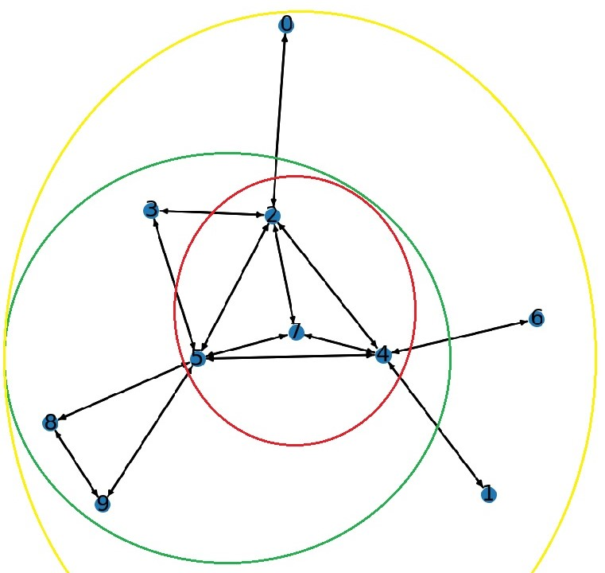

# size-bounded community search (SCS)

###Note : Intial notes added will add more details 

# Problem Statement

Given:
1. graph $G = (V,E)$
2. query $q \in V$ 
3. size constraint $[l,h]$

Find subgraph $H$ of $G$ that satisfies the bellow conditions
1. Connected: $H$ is connected and contains $q$
2. Size bound : $l < |V(H)| < h $.
3. Minimum degree of H is maximum among all sub graphs that satisfy above conditions

# Serial Code 

Code available at : https://drive.google.com/drive/folders/1yW2aDTX1o8mPuXFYd8WWMcQ_MZrFVyjm?usp=sharing

The Serial code can be divided into the following steps

- Read Graph 
- Get core values 
- Get Intial Max min degree using Heuristic Algorithm 
- Calculate distance from query Vertex
- Apply Intial Reduction rules
- Run proposed algorith with or with out the dominating branching. 

## Read Graph 

**Input** : Edge list text file: Each line contains the vertices of an edge, separated by a tab character (\t). The first line specifies the number of vertices and edges.

The graph information is stored in the following arrays:

1. **G** : A map of vertices to their set of neighbors.
2. **Peel Sequence** : Vertices in order of their core values (increasing).
3. **Core** : Core values of the vertices.
4. **P start** : Neighbors Offset 
5. **Edges** : List of neighbors.
6. **n** : Number of Verticies 
7. **m** : Number of Edges
8. **dmax** : Maximun degree in the graph

## Get Core Values
Performs core decomposition on a graph using a peeling algorithm. It updated the *Peel sequence* and *Core* arrays.

It uses a data structure *Linear Heap List*, lets go over the data structure before explaining the process on this function. 

**Linear Heap List** : It consists of 4 arrays and 3 variables
- Heads : Stores the heads of all link list. Each link list has the same Key value (degree). Keys values are intialized to degree of verticies
- Prev : Stores the prev element of all link lists 
- Next : Stores the Next element of all link lists
- Keys : Store the core values
- Key Cap : Max allowed core values ( n-1 ).
- Max Key : Max core value
- Min Key : Min Core Value 

Lets suppose we have a below graph. 

So if we divide the verticies into sets with same degree we get 

| Degree | vertices |
|---|---|
| 6 | { 5 } |
| 5 | { 2, 4 }|
| 3 | { 7 }|
| 2 | { 3, 8, 9} |
| 1 | { 0, 1, 6 } |

We have 5 total link lists with same key value. 

As the total number of vertices (n) is 10, the arrays in *Linear Heap List* will be intialized as 

| Index | Index 0 | Index 1 | Index 2 | Index 3 | Index 4 | Index 5 | Index 6 | Index 7 | Index 8 | Index 9 |
|---|---|---|---|---|---|---|---|---|---|---|
|Keys| 1 | 1 | 5 | 2 | 5 | 6 | 1 | 3 | 2 | 2 |
|Head| 10 |6 | 9 | 7 | 10 | 4 | 5 | 10 | 10 | 10 |
|Next| 10 | 0 | 10 | 10 | 2 | 10 | 1 | 10 | 3 | 8 |
|Prev| 1 | 6 | 4 | 8 | 10 | 10 | 10 | 10 | 9 | 10 |

Note: If a value for a index is not available  in Head, Next or Prev it is set to n (10). 

**Core Decomposition Algorithm**

1. Set core values to zero, max core to zero and store the data in *Linear Heap List*. 
2. iterate through 0 to n-1.
3. Remove the vertex with minimum key value from *Linear Heap List*
4. If degree of removed vertex is greater that *max_core*, update *max_core*.
5. Add vertex to *peel Sequence* and its core value (*max_core*) to *Core*.
6. The key of each neighbor of the removed vertex is decreamented by 1 if neighbor has not been assigned a core value. 

## Get Intial Max min degree using Heuristic Algorithm 
Calculates the intial subgraph that statify all the conditions using heuristic algorithm.

We have the following heuristic Algoriths

### Heuristic 1 

**Intialzie** 
- Create a vector H to store the subgraph with the maximum minimum degree.
- Initialize kl (the maximum minimum degree) to zero. 
- Create arrays hDegree (to store the degree of vertices in the subgraph) and sta (to track the status of vertices).
- Set sta to zero for all vertices. (sta values: 0 = vertex not in Q or H, 1 = vertex in Q, 2 = vertex in H).
- Create a priority queue Q of vertices, with the priority based on the degree of vertex in the original graph.

**Algorithm**
1. Push query vertex in Queue (Q) and set the status to 1. 
2. while(Q is not empty)
    1. Remove top element from Q. 
    2. Iterate through neighbors of removed element, 
        - If neighbors status is 0, push to Q and set status to 1.
        - If neighbors status is 2, increamnet degree of removed vertex and neighbor in HDegree. 
    3. If size of H >= Lower Bound size, Compare and update Max Min Degree (kl)
    4. if size of H = Upper Bound Size, Break 

### Heuristic 2

**Intialzie** 
- Create a vector H to store the subgraph with the maximum minimum degree.
- Initialize kl (the maximum minimum degree) to zero. 
- Create arrays hDegree (to store the degree of vertices in the subgraph) and sta (to track the status of vertices).
- Set sta to zero for all vertices. (sta values: 0 = vertex not in Q or H, 1 = vertex in Q, 2 = vertex in H).
- Create a priority queue Q of vertices, with the priority based on the degree of vertex ($v$) in $H \cup v $.

**Algorithm**
1. Push query vertex in Queue (Q) and set the status to 1. 
2. while Q is not empty
    1. Remove top element from Q. 
    2. Iterate through neighbors of removed element and Calculate the number of neighbors (d_new) each neighbor of the removed vertex has in H.
        - If neighbors status is 0, push to Q and set status to 1.
        - If neighbors status is 1, update prority in Q to d_new. 
        - If neighbors status is 2, increamnet degree of removed vertex and neighbor in HDegree. 
    3. If size of H >= Lower Bound size, Compare and update Max Min Degree (kl)
    4. if size of H = Upper Bound Size, Break 

**Note** : The primary distinction between Heuristic 1 and Heuristic 2 lies in the prioritization criteria. In Heuristic 1, priority is determined by the degree in the original graph, whereas in Heuristic 2, priority is based on the degree in $H \cup v $

## Calculate distance from query Vertex
Calculates the distance of each vetrex from query vertex and stores that information in *q_dist*.

**Intialize**
- Create a array *q_dist* to store distance of each vertex from query vertex, initializing each element to *INF*. 
- Create a Queue (Q) to store the vertices to be processed. 

**Algorithm**
1. While Q is not Empty 
    1. Remove top element (v) from the  Queue. 
    2. itterate throught neighbors of removed vertex. 
        - if neighbors *q_dist* is *INF* update it to be the *q_dist* of the removed vertex plus 1.
        - Push neighbor to the Queue  

**Note** This is a BFS algorithm 

## Apply Intial Reduction rules

Reduced the search space $R$ using reduction rules.

**Reduction Rule 1** : If core value of vertex is less than or equal to  current Min Max degree (kl), remove from Verticies. 

**Reduction Rule 2** :  Diameter (D) is the maximum shortest distance between all pair-wise distance between two vertices in graph

$$
n(k,D) = 
\begin{cases}
    k+D, & \text{if } 1 \leq D \leq 2 or k = 1 \\
    K+D+1+\frac{D}{3}\times (k-2), & \text{otherwise} 
\end{cases}
$$

Set n = upper bound size (h) to calculate the Diameter D. 

For all v in R if *q_dist* is less than Diameter D, remove from R

**Intialize**
- G0 : Vector to stores new verticies that were not removed by reduction rules. 
- G0_Edges : Neighbors of G0.
- G0_x : Number of Neighbors of each vertex
- G0_degree : Degree of each vertex.
- inQ :  status to indicate if in Queue or not.  
- Create a Queue Q, to store the verticies to be processed. Push query vertex to Q and set status to 1.  

**Algorithm** 
1. While Q in not Empty
    1. Remove top vertex from Queue, and push vertex to G0.
    2. Iterate through neighbors of removed vertex. 
        - if core value is greater than Min max degree and *q_dist* is greater than Diameter. 
            - Add neighbor to new Neighbor list *G0_Edges* of vertex.
            - Increase num neighbors and degree of vertex in *G0_x* and *G0_degree*. 
        - if  neighbors status is 0, push to Queue and set status to 1. 

**Note** : This algorithm is also BFS staring from the query vertex 

## Proposed algorithm with dominating branching. 

## Notes

### Progress

1. Implemented draft version, with reduction rule 1,2,3. (Returns right answer)
2. Need to implement time efficient version. (Fixed length array at the beginning) -Implementation compeleted 
3. Need to implement size efficient version. (Shared memory version ).
4. Compare results. 

### Our code 

**Explaination**

1. Read Graphs : The Graph should be edge list (seperated by tab ) with the first line represents numVerticies and numEdges
    The Data is stored in 
        1. pstart : Neighbors offset
        2. edges : Neighbor list
        3. degree : Degree of each vertex 
        4. q_dist : Distance from query vertex of each vertex
        5. core : Core value of each vertex

2. Get Core values of each vertex (currently on CPU): Calculated the core values of each vertex and stores that in Core array. 
TODO: Move to GPU

3. Calculate distance from query vertex (currenlty on CPU) : Calculates the distance of all vertices from query vertex and stores that info in q_dist

4. IntialReductionRules (GPU): copies vertices with core values > Klower and distance from QID <  upperBoundSize.

5. CompressTask (GPU) : Compress array returned by IntialReductionRules Kernel. 

6. SCSSpeedEff (GPU) :  This kernel applies a reduction rule to prune the set $\( R \)$. It also compares and updates the minimum degree, calculates $\( u^* \)$, and determines the potential maximum minimum degree of each subgraph. Using the current task (subgraph) and $\( u^* \)$, it generates new tasks (subgraphs) if the potential maximum degree exceeds $\( k_{\text{lower}} \)$. These new tasks are then added to the task array.

