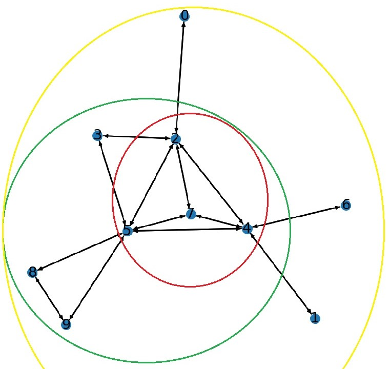

# Serial Code 

Code available [here](https://drive.google.com/drive/folders/1yW2aDTX1o8mPuXFYd8WWMcQ_MZrFVyjm?usp=sharing)

The Serial code can be divided into the following steps

- Read Graph 
- Get core values 
- Get Intial Max min degree using Heuristic Algorithm 
- Calculate distance from query Vertex
- Apply Intial Reduction rules
- Run proposed algorith with or with out the dominating branching. 

## 1. Read Graph 

**Input** : Edge list text file: Each line contains the vertices of an edge, separated by a tab character (\t). The first line specifies the number of vertices and edges.

The graph information is stored in the following arrays:

1. **G** : A map of vertices to their set of neighbors.
2. **Peel Sequence** : Vertices in order of their core values (increasing).
3. **Core** : Core values of the vertices.
4. **P start** : Neighbors Offset 
5. **Edges** : List of neighbors.
6. **n** : Number of Verticies 
7. **m** : Number of Edges
8. **dmax** : Maximun degree in the graph

## 2. Get Core Values
Performs core decomposition on a graph using a peeling algorithm. It updated the *Peel sequence* and *Core* arrays.

It uses a data structure *Linear Heap List*, lets go over the data structure before explaining the process on this function. 

**Linear Heap List** : It consists of 4 arrays and 3 variables
- Heads : Stores the heads of all link list. Each link list has the same Key value (degree). Keys values are intialized to degree of verticies
- Prev : Stores the prev element of all link lists 
- Next : Stores the Next element of all link lists
- Keys : Store the core values
- Key Cap : Max allowed core values ( n-1 ).
- Max Key : Max core value
- Min Key : Min Core Value 

Lets suppose we have a below graph. 

So if we divide the verticies into sets with same degree we get 

| Degree | vertices |
|---|---|
| 6 | { 5 } |
| 5 | { 2, 4 }|
| 3 | { 7 }|
| 2 | { 3, 8, 9} |
| 1 | { 0, 1, 6 } |

We have 5 total link lists with same key value. 

As the total number of vertices (n) is 10, the arrays in *Linear Heap List* will be intialized as 

| Index | Index 0 | Index 1 | Index 2 | Index 3 | Index 4 | Index 5 | Index 6 | Index 7 | Index 8 | Index 9 |
|---|---|---|---|---|---|---|---|---|---|---|
|Keys| 1 | 1 | 5 | 2 | 5 | 6 | 1 | 3 | 2 | 2 |
|Head| 10 |6 | 9 | 7 | 10 | 4 | 5 | 10 | 10 | 10 |
|Next| 10 | 0 | 10 | 10 | 2 | 10 | 1 | 10 | 3 | 8 |
|Prev| 1 | 6 | 4 | 8 | 10 | 10 | 10 | 10 | 9 | 10 |

Note: If a value for a index is not available  in Head, Next or Prev it is set to n (10). 

**Core Decomposition Algorithm**

1. Set core values to zero, max core to zero and store the data in *Linear Heap List*. 
2. iterate through 0 to n-1.
3. Remove the vertex with minimum key value from *Linear Heap List*
4. If degree of removed vertex is greater that *max_core*, update *max_core*.
5. Add vertex to *peel Sequence* and its core value (*max_core*) to *Core*.
6. The key of each neighbor of the removed vertex is decreamented by 1 if neighbor has not been assigned a core value. 

## 3. Get Intial Max min degree using Heuristic Algorithm 
Calculates the intial subgraph that statify all the conditions using heuristic algorithm.

We have the following heuristic Algoriths

### 3.1. Heuristic 1 

**Intializie** 
- Create a vector H to store the subgraph with the maximum minimum degree.
- Initialize kl (the maximum minimum degree) to zero. 
- Create arrays hDegree (to store the degree of vertices in the subgraph) and sta (to track the status of vertices).
- Set sta to zero for all vertices. (sta values: 0 = vertex not in Q or H, 1 = vertex in Q, 2 = vertex in H).
- Create a priority queue Q of vertices, with the priority based on the degree of vertex in the original graph.

**Algorithm**
1. Push query vertex in Queue (Q) and set the status to 1. 
2. while(Q is not empty)
    1. Remove top element from Q. 
    2. Iterate through neighbors of removed element, 
        - If neighbors status is 0, push to Q and set status to 1.
        - If neighbors status is 2, increamnet degree of removed vertex and neighbor in HDegree. 
    3. If size of H >= Lower Bound size, Compare and update Max Min Degree (kl)
    4. if size of H = Upper Bound Size, Break 

### 3.2. Heuristic 2

**Intializie** 
- Create a vector H to store the subgraph with the maximum minimum degree.
- Initialize kl (the maximum minimum degree) to zero. 
- Create arrays hDegree (to store the degree of vertices in the subgraph) and sta (to track the status of vertices).
- Set sta to zero for all vertices. (sta values: 0 = vertex not in Q or H, 1 = vertex in Q, 2 = vertex in H).
- Create a priority queue Q of vertices, with the priority based on the degree of vertex ($v$) in $H \cup v $.

**Algorithm**
1. Push query vertex in Queue (Q) and set the status to 1. 
2. while Q is not empty
    1. Remove top element from Q. 
    2. Iterate through neighbors of removed element and Calculate the number of neighbors (d_new) each neighbor of the removed vertex has in H.
        - If neighbors status is 0, push to Q and set status to 1.
        - If neighbors status is 1, update prority in Q to d_new. 
        - If neighbors status is 2, increamnet degree of removed vertex and neighbor in HDegree. 
    3. If size of H >= Lower Bound size, Compare and update Max Min Degree (kl)
    4. if size of H = Upper Bound Size, Break 

**Note** : The primary distinction between Heuristic 1 and Heuristic 2 lies in the prioritization criteria. In Heuristic 1, priority is determined by the degree in the original graph, whereas in Heuristic 2, priority is based on the degree in $H \cup v $

## 4. Calculate distance from query Vertex
Calculates the distance of each vetrex from query vertex and stores that information in *q_dist*.

**Intialize**
- Create a array *q_dist* to store distance of each vertex from query vertex, initializing each element to *INF*. 
- Create a Queue (Q) to store the vertices to be processed. 

**Algorithm**
1. While Q is not Empty 
    1. Remove top element (v) from the  Queue. 
    2. itterate throught neighbors of removed vertex. 
        - if neighbors *q_dist* is *INF* update it to be the *q_dist* of the removed vertex plus 1.
        - Push neighbor to the Queue  

**Note** This is a BFS algorithm 

## 5. Apply Intial Reduction rules

Reduced the search space $R$ using reduction rules.

**Reduction Rule 1** : If core value of vertex is less than or equal to  current Min Max degree (kl), remove from Verticies. 

**Reduction Rule 2** :  Diameter (D) is the maximum shortest distance between all pair-wise distance between two vertices in graph

$$
n(k,D) = 
\begin{cases}
    k+D, & \text{if } 1 \leq D \leq 2 \text{ or } k = 1 \\
    K+D+1+\frac{D}{3}\times (k-2), & \text{otherwise} 
\end{cases}
$$

Set n = upper bound size (h) to calculate the Diameter D. 

For all v in R if *q_dist* is less than Diameter D, remove from R

**Intialize**
- G0 : Vector to stores new verticies that were not removed by reduction rules. 
- G0_Edges : Neighbors of G0.
- G0_x : Number of Neighbors of each vertex
- G0_degree : Degree of each vertex.
- inQ :  status to indicate if in Queue or not.  
- Create a Queue Q, to store the verticies to be processed. Push query vertex to Q and set status to 1.  

**Algorithm** 
1. While Q in not Empty
    1. Remove top vertex from Queue, and push vertex to G0.
    2. Iterate through neighbors of removed vertex. 
        - if core value is greater than Min max degree and *q_dist* is greater than Diameter. 
            - Add neighbor to new Neighbor list *G0_Edges* of vertex.
            - Increase num neighbors and degree of vertex in *G0_x* and *G0_degree*. 
        - if  neighbors status is 0, push to Queue and set status to 1. 

**Note** : This algorithm is also BFS staring from the query vertex 

## 6. Proposed algorithm with dominating branching. 

This a a recursive Algorithm. 

**Intialize**
- VI : Vector of verticies that are in subgraph (C). Push query vertex in VI
- inVI : Status indicating whether in VI or not. Set status of query vertex to 1 and rest to zero. 
- VR :  Vector of verticies that are not in  subgraph (R = G - C - verticies removed by intial reduction rules). Push all verticies except query vertex to VR. 
- inVR : Status indicating whether in VR or not. Set status to 1 for all verticies, except for query vertex. Set to 0 for query vertex. 
- degVI : Degree in VI, set to 0 for all verticies
- degVIVR : Degree in VI $\cup$ VR. intialize to value of *G0_degree* for all verticies. 
- NEI : Vector that stores the Neighbors of all verticies of VI (C) that are present in VR (R).
- inNEI : Status indicates if in NEI or not. 
- NEI_score : Stores the connection score value

**Algorithm**
1. Run function on VI (C), VR (R). 
2. If size of VI in between l and h, min degree of VI is greater than max min degree, update max min degree. 
3. if size of VI is greater than or equal to upper bound size, Break 
4. Apply reduction rules on VR 
5. Calculate Upper bound degree for current VI and VR. 
5. If size of VI is less than H, VR is not empty and Upper bound degree > MAx Min degree 
    - Find Ustar 
    - Find dominating set of Ustar
    - Iterate through dominating set ($dv_{i}$)
        - Call function recursively on $VI \cup \{ustar, dv_{i}\}$ and  $ VR \text{\ } \{dv_{1} \text{to} dv_{i}\}$
6. call function recursively on $VI \cup \{ustar\}$ and $VR \text{\ } \{\text{ustar, dominating set}\}$
7. call function recursively on $VI$ and $VR \text{\ } \{\text{ustar, dominating set}\}$

### 6.1. Calculate Upper bound degree for current VI and VR.

**Degree Based**
1. $U_{d} = min_{u \in C} min (d_{C \cup R}(u), d_{C}(u)+h-|C|)$
2. if $U_{d}$ is less than or equal to  Max Min degree, reject the branch. 

**Algorithm 1**
1. Set the minimum upper bound degree to *INF*.
2. Iterate through each vertex \(u\) in \(VI (C)\).
    - Calculate the number of neighbors present in \(VR (R)\).
    - Find its degree \(d_C(u)\) in \(VI (C)\), and compute the sum of this degree and the difference between the upper bound size \(h\) and the subgraph size \(|C|\).
    - Set the upper bound degree to minimum of the values calculated in the above two steps.
    - If the upper bound degree is less than the mimimum upper bound degree, update the upper bound degree.
3. Return minimum upper bound degree. 

**Note**: Time complexity $= |C| \times degree_{avg}$ 

**Algorithm 2**
1. TODO : Add notes

**Algorithm 3**
1. Add notes

### 6.2 Find Ustar

*Connection score* of vertex v in R is the reciprocal sum of degrees of neighbors of v if added in C.
*Ustar* is the vertex from R that has the maximum *connection score*, is used to generate new branches.

**Algorithm 1**
1. Intialize Max connection score to *0* and ustar to *-1*.
2. Iterate throught verticies in NEI (Neighbors of all verticies of C that are present in R ).
    - Set connection score to zero. 
    - For each vertex iterate through the neighbors that are in VI (C).
        -  Increament connection score by the reciprocal of degree of neighbor in VI (C).
    - if connection score is greater than Max connection score update Max connection score. Set ustar to vertex. 
3. Return ustar

**Note**: 
- Ustar is selected based on the Vertex in R that is more connected to C and connected to those verticies in C that have lower degree. 
- Time complexity $= |NEI| \times degree_{avg}$ 

**Algorithm 2**
1. Intialize Max connection score to *0* and ustar to *-1*.
2. Iterate throught verticies in NEI (Neighbors of all verticies of C that are present in R ).
    - Set connection score to number of neighbor that are in VI (C). 
    - if connection score is greater than Max connection score update Max connection score. Set ustar to vertex. 
3. Return ustar

**Note:**
- Ustar is selected based on the Vertex in R that is more connected to C. 
- Time complexity $= |NEI| \times degree_{avg}$  

**Algorithm 3**
Todo: add notes later 

### 6.3. Find dominating set of Ustar

**Vertex Domination*: Given at vertex $v \in R$ and $v^{'} \in R$, V dominates $v^{'}$ if every neighbor of $v^{'}$ in $(C \cup R)$ is either neighbor of v or v itself. 

*Dominating set* : consistes of all verticies of R that are dominated by Ustar.

Ustar and Dominating set will be used to create new branches.

**Algorithm 1**
1. itterate through verticies (v) in NEI.
    - set is_dom to *true*
    - Itterate throught neighbors(u) of vertex (v). 
    - If neighbor is either in C or R.
        - If all any neighbor of ustar is greater than neighbor (u), set is_dom to false.  // Confusion 
        - If is_dom is true, Calculate connection score of the vertex (v)
        - Push vertex and connection score to vector pair.
2. return dominating vertex set in decreasing order of connection score. 

I have highlighted a step in red. We should be checking if the all the neighbors of vertex are either neighbors of Ustar or ustar itself. But the code is check if all the neighbors of vertex are greater than neighbors of Ustar. 

